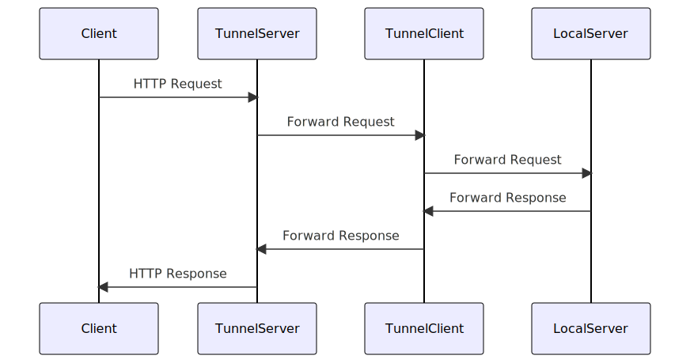

# HTTP endpoint

HTTP endpoint is a listening point where the Tunnelize server listens for incoming HTTP requests. It allows clients to tunnel local HTTP traffic through the Tunnelize server. 



Tunnels configured to forward HTTP traffic first connect to the server where they get
assigned a domain to where a client can connect to through a browser to access the local
HTTP server.

When a client first connects to the HTTP endpoint, server uses the `Host` header
to decide to which tunnel it needs to connect to. After tunnel is found, a link is
established between client and tunnel and data is forwarded until either side closes the
connection.

## Configuring endpoint

Default HTTP endpoint configuration looks like this:

```json
 {
    "type": "http",
    "port": 3457,
    "encryption": {
        "type": "none"
    },
    "address": null,
    "max_client_input_wait_secs": 10,
    "hostname_template": "tunnel-{name}.localhost",
    "full_url_template": null,
    "allow_custom_hostnames": true,
    "require_authorization": null
}
```

Fields:

| Field                      | Description                                                                                                                  | Default Value                    |
| -------------------------- | ---------------------------------------------------------------------------------------------------------------------------- | -------------------------------- |
| type                       | The type of the connection. Always `http` for http endpoint.                                                                 | No default                       |
| port                       | The port number for the connection                                                                                           | No default                       |
| encryption                 | The type of encryption used. See [configuring encryption](#configuring-encryption) below.                                    | No default                       |
| address                    | The address for the connection to bind to. Defaults to 0.0.0.0 (all interfaces).                                             | 0.0.0.0                          |
| max_client_input_wait_secs | Maximum amount of seconds on how long to wait between start of TCP connection and first request being sent.                  | 10                               |
| hostname_template          | Template for the hostname to use when generating a hostname. See [configuring templates](#configuring-templates) below.      | No default                       |
| full_url_template          | Template for the full URL to use when returning it to the tunnel. See [configuring templates](#configuring-templates) below. | Automatic generation if not set. |
| allow_custom_hostnames     | Whether custom hostnames are allowed                                                                                         | No default                       |
| require_authorization      | Whether authorization is required                                                                                            | No authorization required        |

### Configuring encryption

### Configuring templates

# Making Tunnelize work behind